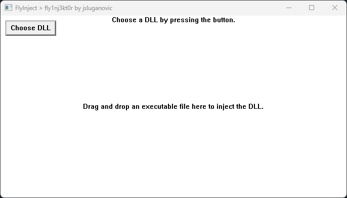
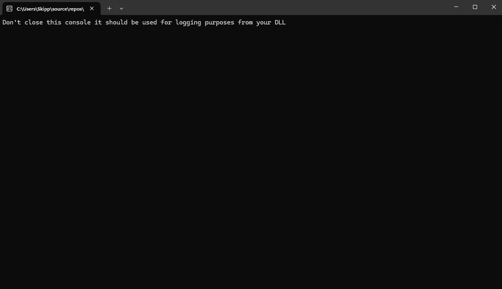

# FlyInject (fly1nj3kt0r)

**FlyInject** is a simple Windows-based application for injecting a DLL (Dynamic Link Library) into a target process. It provides a graphical user interface (GUI) where users can select a DLL file and drag and drop an executable file to perform the injection. The application uses remote thread injection to inject the DLL into the chosen process.

## Features

- **DLL Injection:** Injects a specified DLL into the selected process using the Windows API.
- **Process Selection:** Drag and drop an executable (.exe) file to automatically start and inject the DLL.
- **File Dialog:** Easy DLL selection via an Open File dialog.
- **User Interface:** A simple GUI to guide the user through DLL injection.

## Requirements

- Windows operating system (Windows 7 and above).
- Visual Studio or any C++ compiler that supports Windows API and Win32 development.

## How It Works

The program follows these steps:

1. **DLL Selection:** You choose the DLL to be injected using a file dialog.
2. **Drag-and-Drop Executable:** Drop the executable file of the target process into the GUI.
3. **Process Creation:** The dropped executable is launched, and the process ID is retrieved.
4. **DLL Injection:** The DLL is injected into the process using `CreateRemoteThread` and `LoadLibraryW`.
5. **Injection Success/Failure:** A message box notifies the user if the injection succeeded or failed.

## Usage

### 1. Clone the repository

```bash
git clone https://github.com/jsluganovic/flyinject.git
```

### 2. Build the project

You can build the project using any C++ compiler that supports Win32 API development (e.g., Visual Studio).

### 3. Run the application

After building the project, run the executable. You will see a window with a button to select a DLL file and instructions to drag and drop an executable file for injection.

### 4. Inject DLL

1. Click the **Choose DLL** button to select the DLL file you want to inject.
2. Drag and drop the target executable file onto the window.
3. The application will start the process and inject the selected DLL into it.

## Code Overview

- **InjectDLL Function:**
  - This function performs the DLL injection by allocating memory in the target process and creating a remote thread to call `LoadLibraryW` with the DLL path.
  
- **GetProcessIdByName Function:**
  - Retrieves the process ID of the running executable based on its name.
  
- **ChooseDLLFile Function:**
  - Opens a file dialog to let the user select a DLL file.

- **Main GUI Logic:**
  - The main window is created using the Win32 API and handles file drag-and-drop, button clicks, and painting messages.
  
- **Drag-and-Drop Handling:**
  - Accepts the dropped executable file, starts the process, and calls `InjectDLL`.

## Example

Here is an example of what the window will look like:

- After selecting a DLL:
  - `C:\path\to\your.dll`
- Drag and drop an executable to start the injection:
  - The executable will be started, and the DLL will be injected.

### Screenshot



## Notes

- Make sure that the process you're injecting into has enough permissions to allow DLL injection.
- The application uses `OpenProcess` with `PROCESS_ALL_ACCESS` to gain access to the target process.
  
## Contributing

If you would like to contribute, feel free to submit pull requests or report issues.

## License

This project is licensed under the MIT License - see the [LICENSE](LICENSE) file for details.

---

**FlyInject** created by [jsluganovic](https://github.com/jsluganovic).
